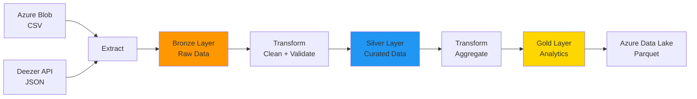

# Proyecto Final: Pipeline de Datos Spotify Analytics

**Autor:** Elias Martinez  
**Curso:** Proyectos reales de Ingeniería de Datos con Python  
**Institución:** BSG Institute  
**Proveedor Cloud:** Microsoft Azure  
**Fecha:** Abril 2026

---

## 📝 Resumen del Proyecto

Pipeline de ingeniería de datos end-to-end que integra datos de música desde múltiples fuentes heterogéneas (CSV histórico + API REST en tiempo real), los procesa mediante transformaciones ETL siguiendo la arquitectura Medallion (Bronze → Silver → Gold), y almacena los resultados en Azure Data Lake Storage Gen2 en formato Parquet particionado, listos para análisis con Azure Synapse Analytics.

**Problema resuelto:** Consolidar datos de artistas y canciones de Spotify Wrapped (CSV) con información actualizada de Deezer API para generar métricas de popularidad y rendimiento por artista, permitiendo análisis de tendencias musicales.

---

## 🏗️ Arquitectura

### Diagrama Lógico del Pipeline



### Mapeo a Servicios Azure

| Capa | Servicio Azure | Formato |
|------|----------------|---------|
| **Ingesta CSV** | Azure Blob Storage | CSV |
| **Ingesta API** | Deezer Public API | JSON |
| **Bronze** | Azure Data Lake Gen2 | Parquet particionado |
| **Silver** | Azure Data Lake Gen2 | Parquet particionado |
| **Gold** | Azure Data Lake Gen2 | Parquet |
| **Serving** | Azure Synapse Analytics | Tablas externas |

Ver documentación completa en: [architecture/architecture.md](architecture/architecture.md)

---

## 🚀 Cómo Ejecutar Localmente

### 1. Prerrequisitos

```bash
# Python 3.11+
python --version

# Git
git --version
```

### 2. Clonar el repositorio

```bash
git clone <url-del-repo>
cd "Proyecto Final Elias Martinez BSG Data Engineer"
```

### 3. Instalar dependencias

```bash
make install
```

O manualmente:

```bash
pip install -r requirements.txt
```

### 4. Configurar variables de entorno

```bash
# Copiar plantilla
cp .env.example .env

# Editar con tus credenciales
nano .env
```

**Variables requeridas:**
```bash
# Azure Blob Storage
CONEXION_AZURE=DefaultEndpointsProtocol=https;AccountName=XXX;AccountKey=XXX
AZURE_CONTAINER_NAME=tu-contenedor
AZURE_BLOB_NAME=spotify_wrapped_2025.csv

# Azure Data Lake Gen2
ADLS_ACCOUNT_NAME=tu-cuenta-adls
ADLS_ACCOUNT_KEY=tu-clave-larga
ADLS_CONTAINER_NAME=tu-contenedor
```

### 5. Ejecutar el pipeline

```bash
make run
```

O manualmente:

```bash
python src/main.py
```

### 6. Verificar resultados

El pipeline debe terminar con:

```
INFO - === PIPELINE COMPLETADO EXITOSAMENTE ===
INFO - Bronze: 1593 registros
INFO - Silver: 1589 registros
INFO - Gold: 120 artistas
INFO - Pipeline ejecutado correctamente
```

**Exit code:** `0` = éxito, `1` = error

---

## ☁️ Cómo Ejecutar en Azure

### Opción 1: Azure Data Factory (Recomendado para producción)

**1. Crear recursos:**

```bash
# Terraform (futuro)
cd infra/terraform
terraform init
terraform apply
```

**2. Configurar pipeline en ADF:**

- Activity Type: `Python Script`
- Comando: `python src/main.py`
- Linked Service: Azure Data Lake Gen2
- Trigger: Programado (diario a las 2 AM UTC)

**3. Monitorear:**

Portal Azure → Data Factory → Monitor → Pipeline Runs

### Opción 2: Azure Container Instances (Ejecución manual)

```bash
# Crear imagen Docker
docker build -t spotify-pipeline .

# Push a Azure Container Registry
az acr login --name <tu-registry>
docker push <tu-registry>.azurecr.io/spotify-pipeline:latest

# Ejecutar
az container create \
  --resource-group <rg> \
  --name spotify-pipeline \
  --image <tu-registry>.azurecr.io/spotify-pipeline:latest \
  --environment-variables \
    CONEXION_AZURE="..." \
    ADLS_ACCOUNT_NAME="..."
```

### Opción 3: Azure Functions (Serverless)

```bash
# Desplegar como Function App
func azure functionapp publish <nombre-function-app>
```

Ver guía completa: [docs/SETUP.md](docs/SETUP.md)

---

## 📊 Estructura de Datos (Medallion Architecture)

### Bronze Layer (Raw Zone)

**Propósito:** Datos sin procesar tal como llegan de las fuentes.

**Ubicación:** `bronze/spotify/ingestion_date=YYYY-MM-DD/datos.parquet`

**Esquema:**
```json
{
  "nombre_artista": "string",
  "id_artista": "string",
  "cancion": "string",
  "popularidad": "int",
  "followers": "int",
  "generos": "string",
  "fuente": "string",  // 'CSV' o 'API'
  "ingestion_timestamp": "datetime"
}
```

**Registros típicos:** ~1500-2000

### Silver Layer (Curated Zone)

**Propósito:** Datos limpios, deduplicados y validados.

**Ubicación:** `silver/spotify/event_date=YYYY-MM-DD/datos.parquet`

**Transformaciones aplicadas:**
- ✅ Eliminación de nulos en `nombre_artista`
- ✅ Deduplicación por `(id_artista, cancion)`
- ✅ Validación de esquema con JSON Schema
- ✅ Agregar `fecha_procesamiento`

**Registros típicos:** ~1500-1900 (pérdida <5%)

### Gold Layer (Serving Zone)

**Propósito:** Datos agregados listos para análisis.

**Ubicación:** `gold/spotify/metricas_artistas.parquet`

**Esquema:**
```json
{
  "nombre_artista": "string",
  "id_artista": "string",
  "total_canciones": "int",
  "popularidad_promedio": "float",
  "popularidad_maxima": "int",
  "fuente_datos": "string"
}
```

**Métricas calculadas:**
- Total de canciones por artista
- Popularidad promedio (redondeado a 2 decimales)
- Popularidad máxima alcanzada

**Registros típicos:** ~100-150 artistas únicos

Ver contratos de datos: [data_contracts/schemas/](data_contracts/schemas/)

---

## 🎯 Decisiones Técnicas Clave

### 1. Azure como proveedor cloud

**Justificación:** Compatibilidad con entorno laboral existente y familiaridad con servicios Azure.

**Alternativas consideradas:** AWS (S3 + Glue), GCP (GCS + Dataflow)

### 2. Deezer API en vez de Spotify API

**Justificación:** Spotify API requiere OAuth complejo. Deezer ofrece API pública sin autenticación.

**Trade-off:** Menos datos disponibles (sin géneros detallados), pero mayor simplicidad.

### 3. Apache Parquet para almacenamiento

**Justificación:** 
- Compresión ~10x mejor que CSV
- Lectura columnar eficiente
- Compatible con Synapse/Databricks

**Trade-off:** No legible por humanos (requiere herramientas).

### 4. Arquitectura Medallion (Bronze/Silver/Gold)

**Justificación:** Estándar de la industria para Data Lakes. Permite:
- Trazabilidad (datos raw siempre disponibles)
- Reprocessamiento (si Silver falla, Bronze sigue intacto)
- Separación de responsabilidades

### 5. Validación con JSON Schema

**Justificación:** Detectar cambios en esquemas de fuentes antes de romper el pipeline.

**Beneficio:** Fallos rápidos con mensajes claros.

---

## 💰 Costos Estimados (Azure)

### Ejecución diaria (30 días)

| Servicio | Uso mensual | Costo USD/mes |
|----------|-------------|---------------|
| **Azure Blob Storage** | 1 GB almacenado | $0.02 |
| **Azure Data Lake Gen2** | 5 GB almacenado | $0.10 |
| **Transferencia de datos** | 10 GB salida | $0.87 |
| **Deezer API** | Gratis (pública) | $0.00 |
| **Azure Data Factory** | 30 ejecuciones | $1.50 |
| **Azure Monitor** | Logs básicos | $0.50 |
| **TOTAL** | | **~$3.00/mes** |

**Nota:** Costos estimados para ambiente de desarrollo. Producción puede variar según:
- Volumen de datos
- Retención de históricos
- Frecuencia de ejecución
- Uso de Synapse Analytics ($5-10 DWU/hora)

### Optimizaciones de costo:

- ✅ Usar tier "Cool" para datos Bronze antiguos (>30 días)
- ✅ Comprimir con Parquet (ahorro 80-90% vs CSV)
- ✅ Particionamiento por fecha (consultas más eficientes)
- ✅ Lifecycle management (borrar Bronze >90 días)

---

## 🔒 Seguridad

### Manejo de Credenciales

✅ **Variables de entorno:** Todas las credenciales en `.env` (nunca en código)

✅ **Gitignore:** `.env` excluido del repositorio

✅ **Rotación:** Cambiar claves de Azure cada 90 días (recomendado)

### Acceso a Datos

✅ **RBAC:** Role-Based Access Control en Azure

- Pipeline: `Storage Blob Data Contributor`
- Analistas: `Storage Blob Data Reader` (solo lectura)

✅ **Network:** Restringir acceso a Storage Account por IP (opcional)

### Datos Sensibles

❌ **Sin PII:** No se procesan datos personales (solo artistas públicos)

✅ **Encriptación:** Datos en tránsito (HTTPS) y reposo (Azure default encryption)

---

## 🧪 Tests

### Ejecutar todos los tests

```bash
make test
```

O manualmente:

```bash
pytest tests/ -v
```

### Tests implementados

- ✅ `test_crear_bronze()`: Valida integración CSV + API
- ✅ `test_limpiar_datos()`: Valida deduplicación y limpieza

### Coverage

```bash
pytest tests/ --cov=src --cov-report=html
open htmlcov/index.html
```

**Target:** >80% coverage

---

## 📁 Estructura del Proyecto

```
Proyecto Final Elias Martinez BSG Data Engineer/
├── .github/
│   └── workflows/
│       └── ci.yml                 # GitHub Actions CI/CD
├── architecture/
│   └── architecture.md            # Diseño técnico detallado
├── data_contracts/
│   └── schemas/
│       ├── bronze_schema.json     # Validación Bronze
│       ├── silver_schema.json     # Validación Silver
│       └── gold_schema.json       # Validación Gold
├── docs/
│   ├── RUNBOOK.md                 # Manual operativo
│   └── SETUP.md                   # Guía de instalación
├── src/
│   ├── main.py                    # Orquestador principal
│   ├── pipeline/
│   │   ├── extract.py             # Extracción de datos
│   │   ├── transform.py           # Transformaciones ETL
│   │   └── load.py                # Carga a Azure
│   └── utils/
│       ├── conexion.py            # Clientes Azure
│       └── validador.py           # Validación de esquemas
├── tests/
│   ├── test_extract.py
│   └── test_transforms.py
├── .env.example                   # Plantilla de variables
├── .gitignore
├── Makefile                       # Comandos automatizados
├── README.md                      # Este archivo
└── requirements.txt               # Dependencias Python
```

---

## 🔄 CI/CD

Pipeline de GitHub Actions configurado en `.github/workflows/ci.yml`

**Se ejecuta en:**
- Push a `main` o `develop`
- Pull Requests a `main`

**Pasos:**
1. ✅ Instalar dependencias
2. ✅ Lint (validar sintaxis Python)
3. ✅ Ejecutar tests con coverage
4. ✅ Validar JSON schemas
5. ✅ Verificar imports

**Badge:** (Agregar después de primer push)

---

## 📚 Documentación Adicional

- **Arquitectura detallada:** [architecture/architecture.md](architecture/architecture.md)
- **Manual operativo:** [docs/RUNBOOK.md](docs/RUNBOOK.md)
- **Guía de instalación:** [docs/SETUP.md](docs/SETUP.md)

---

## 🤝 Contribuir

```bash
# 1. Crear rama
git checkout -b feature/nueva-funcionalidad

# 2. Hacer cambios y commit
git add .
git commit -m "feat: agregar nueva funcionalidad"

# 3. Push y crear PR
git push origin feature/nueva-funcionalidad
```

**Convención de commits:** [Conventional Commits](https://www.conventionalcommits.org/)

---

## 📧 Contacto

**Autor:** Elias Martinez  
**Email:** [tu-email@example.com]  
**LinkedIn:** [tu-perfil-linkedin]  
**GitHub:** [tu-usuario-github]

---

## 📄 Licencia

Este proyecto fue desarrollado como parte del Proyecto Final del curso de Ingeniería de Datos con Python de BSG Institute.

---

**Última actualización:** Abril 2026
