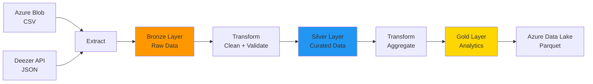

# Proyecto Final: Pipeline de Datos Spotify Analytics

**Autor:** Elias Martinez  
**Curso:** Proyectos reales de Ingeniería de Datos con Python  
**Institución:** BSG Institute  
**Cloud:** Azure  
**Fecha:** Abril 2026

---

## Video

> [Video de youtube explicativo](https://youtu.be/1ANP2qBVNHY)

---

## Tabla de Contenidos

1. [Resumen del Proyecto](#resumen-del-proyecto)
2. [Arquitectura](#arquitectura)
   - [Diagrama Lógico del Pipeline](#diagrama-lógico-del-pipeline)
   - [Mapeo a Servicios Azure](#mapeo-a-servicios-azure)
3. [Cómo Ejecutar Localmente](#cómo-ejecutar-localmente)
4. [Cómo Ejecutar en Azure](#cómo-ejecutar-en-azure)
5. [Estructura de Datos (Medallion Architecture)](#estructura-de-datos-medallion-architecture)
   - [Bronze Layer (Raw Zone)](#bronze-layer-raw-zone)
   - [Silver Layer (Curated Zone)](#silver-layer-curated-zone)
   - [Gold Layer (Serving Zone)](#gold-layer-serving-zone)
6. [Decisiones Técnicas Clave](#decisiones-técnicas-clave)
7. [Costos Estimados (Azure)](#costos-estimados-azure)
8. [Seguridad](#seguridad)
9. [Tests](#tests)
10. [Estructura del Proyecto](#estructura-del-proyecto)
11. [CI/CD](#cicd)
12. [Documentación Adicional](#documentación-adicional)
13. [Contribuir](#contribuir)
14. [Contacto](#contacto)
15. [Licencia](#licencia)

---

## Resumen del Proyecto

Pipeline ETL que junta datos de Spotify Wrapped (CSV en Azure Blob) con datos actualizados de Deezer API. Usa arquitectura Medallion (Bronze/Silver/Gold) y guarda todo en Azure Data Lake como Parquet.

**Qué hace:** Analiza popularidad de artistas y canciones, limpia duplicados, y genera métricas agregadas listas para dashboards.

---

## Arquitectura

### Diagrama Lógico del Pipeline



### Mapeo a Servicios Azure

| Capa | Servicio Azure | Formato |
|------|----------------|---------|
| **Ingesta CSV** | Azure Blob Storage | CSV |
| **Ingesta API** | Deezer Public API | JSON |
| **Bronze** | Azure Data Lake Gen2 | Parquet particionado |
| **Silver** | Azure Data Lake Gen2 | Parquet particionado |
| **Gold** | Azure Data Lake Gen2 | Parquet |
| **Serving** | Azure Synapse Analytics | Tablas externas |

Ver documentación completa en: [architecture/architecture.md](architecture/architecture.md)

---

## Cómo Ejecutar Localmente

### 1. Prerrequisitos

```bash
# Python 3.11+
python --version

# Git
git --version
```

### 2. Clonar el repositorio

```bash
git clone <url-del-repo>
cd "Proyecto Final Elias Martinez BSG Data Engineer"
```

### 3. Instalar dependencias

```bash
make install
```

O manualmente:

```bash
pip install -r requirements.txt
```

### 4. Configurar variables de entorno

```bash
# Copiar plantilla
cp .env.example .env

# Editar con tus credenciales
nano .env
```

**Variables requeridas:**
```bash
# Azure Blob Storage
CONEXION_AZURE=DefaultEndpointsProtocol=https;AccountName=XXX;AccountKey=XXX
AZURE_CONTAINER_NAME=tu-contenedor
AZURE_BLOB_NAME=spotify_wrapped_2025.csv

# Azure Data Lake Gen2
ADLS_ACCOUNT_NAME=tu-cuenta-adls
ADLS_ACCOUNT_KEY=tu-clave-larga
ADLS_CONTAINER_NAME=tu-contenedor
```

### 5. Ejecutar el pipeline

```bash
make run
```

O manualmente:

```bash
python src/main.py
```

### 6. Verificar resultados

El pipeline debe terminar con:

```
INFO - === PIPELINE COMPLETADO EXITOSAMENTE ===
INFO - Bronze: 1593 registros
INFO - Silver: 1589 registros
INFO - Gold: 120 artistas
INFO - Pipeline ejecutado correctamente
```

**Exit code:** `0` = éxito, `1` = error

---

## Cómo Ejecutar en Azure

### Opción 1: Azure Data Factory (Recomendado para producción)

**1. Crear recursos:**

```bash
# Terraform (futuro)
cd infra/terraform
terraform init
terraform apply
```

**2. Configurar pipeline en ADF:**

- Activity Type: `Python Script`
- Comando: `python src/main.py`
- Linked Service: Azure Data Lake Gen2
- Trigger: Programado (diario a las 2 AM UTC)

**3. Monitorear:**

Portal Azure → Data Factory → Monitor → Pipeline Runs

### Opción 2: Azure Container Instances (Ejecución manual)

```bash
# Crear imagen Docker
docker build -t spotify-pipeline .

# Push a Azure Container Registry
az acr login --name <tu-registry>
docker push <tu-registry>.azurecr.io/spotify-pipeline:latest

# Ejecutar
az container create \
  --resource-group <rg> \
  --name spotify-pipeline \
  --image <tu-registry>.azurecr.io/spotify-pipeline:latest \
  --environment-variables \
    CONEXION_AZURE="..." \
    ADLS_ACCOUNT_NAME="..."
```

### Opción 3: Azure Functions (Serverless)

```bash
# Desplegar como Function App
func azure functionapp publish <nombre-function-app>
```

Ver guía completa: [docs/SETUP.md](docs/SETUP.md)

---

## Estructura de Datos (Medallion Architecture)

### Bronze Layer (Raw Zone)

**Propósito:** Datos sin procesar tal como llegan de las fuentes.

**Ubicación:** `bronze/spotify/ingestion_date=YYYY-MM-DD/datos.parquet`

**Esquema:**
```json
{
  "nombre_artista": "string",
  "id_artista": "string",
  "cancion": "string",
  "popularidad": "int",
  "followers": "int",
  "generos": "string",
  "fuente": "string",  // 'CSV' o 'API'
  "ingestion_timestamp": "datetime"
}
```

**Registros típicos:** ~1500-2000

### Silver Layer (Curated Zone)

**Propósito:** Datos limpios, deduplicados y validados.

**Ubicación:** `silver/spotify/event_date=YYYY-MM-DD/datos.parquet`

**Transformaciones aplicadas:**
- Eliminación de nulos en `nombre_artista`
- Deduplicación por `(id_artista, cancion)`
- Validación de esquema con JSON Schema
- Agregar `fecha_procesamiento`

**Registros típicos:** ~1500-1900 (pérdida <5%)

### Gold Layer (Serving Zone)

**Propósito:** Datos agregados listos para análisis.

**Ubicación:** `gold/spotify/metricas_artistas.parquet`

**Esquema:**
```json
{
  "nombre_artista": "string",
  "id_artista": "string",
  "total_canciones": "int",
  "popularidad_promedio": "float",
  "popularidad_maxima": "int",
  "fuente_datos": "string"
}
```

**Métricas calculadas:**
- Total de canciones por artista
- Popularidad promedio (redondeado a 2 decimales)
- Popularidad máxima alcanzada

**Registros típicos:** ~100-150 artistas únicos

Ver contratos de datos: [data_contracts/schemas/](data_contracts/schemas/)

---

## Decisiones Técnicas

### Por qué Azure

Ya conocía Azure del trabajo/curso anterior, entonces fue más fácil.

### Por qué Deezer en vez de Spotify

Spotify API necesita OAuth que es complicado. Deezer es pública y gratis.

### Por qué Parquet

Comprime mejor que CSV (~10x) y es más rápido de leer. Compatible con Synapse/Databricks.

### Por qué Medallion (Bronze/Silver/Gold)

Es el estándar. Si algo sale mal en Silver, siempre puedo reprocesar desde Bronze.

### Por qué validar con JSON Schema

Si el CSV cambia de formato, me entero antes de que explote todo.

---

## Costos (Azure)

Para desarrollo, cuesta ~$3 USD/mes:
- Blob Storage: $0.02
- Data Lake: $0.10
- Data Factory: $1.50
- Otros: $1.38

**Nota:** Producción costaría más si usas Synapse ($5-10/hora).

---

## Seguridad

- Todas las credenciales en `.env` (nunca en código)
- `.env` en .gitignore
- RBAC en Azure: `Storage Blob Data Contributor`
- No hay datos personales (solo artistas públicos)

---

## Tests

### Ejecutar todos los tests

```bash
make test
```

O manualmente:

```bash
pytest tests/ -v
```

### Tests implementados

- `test_crear_bronze()`: Valida integración CSV + API
- `test_limpiar_datos()`: Valida deduplicación y limpieza

### Coverage

```bash
pytest tests/ --cov=src --cov-report=html
open htmlcov/index.html
```

**Target:** >80% coverage

---

## Estructura del Proyecto

```
Proyecto Final Elias Martinez BSG Data Engineer/
├── .github/
│   └── workflows/
│       └── ci.yml                 # GitHub Actions CI/CD
├── architecture/
│   └── architecture.md            # Diseño técnico detallado
├── data_contracts/
│   └── schemas/
│       ├── bronze_schema.json     # Validación Bronze
│       ├── silver_schema.json     # Validación Silver
│       └── gold_schema.json       # Validación Gold
├── docs/
│   ├── RUNBOOK.md                 # Manual operativo
│   └── SETUP.md                   # Guía de instalación
├── src/
│   ├── main.py                    # Orquestador principal
│   ├── pipeline/
│   │   ├── extract.py             # Extracción de datos
│   │   ├── transform.py           # Transformaciones ETL
│   │   └── load.py                # Carga a Azure
│   └── utils/
│       ├── conexion.py            # Clientes Azure
│       └── validador.py           # Validación de esquemas
├── tests/
│   ├── test_extract.py
│   └── test_transforms.py
├── .env.example                   # Plantilla de variables
├── .gitignore
├── Makefile                       # Comandos automatizados
├── README.md                      # Este archivo
└── requirements.txt               # Dependencias Python
```

---

## CI/CD

Pipeline de GitHub Actions configurado en `.github/workflows/ci.yml`

**Se ejecuta en:**
- Push a `main` o `develop`
- Pull Requests a `main`

**Pasos:**
1. Instalar dependencias
2. Lint (validar sintaxis Python)
3. Ejecutar tests con coverage
4. Validar JSON schemas
5. Verificar imports

**Badge:** (Agregar después de primer push)

---

## Documentación Adicional

- **Arquitectura detallada:** [architecture/architecture.md](architecture/architecture.md)
- **Manual operativo:** [docs/RUNBOOK.md](docs/RUNBOOK.md)
- **Guía de instalación:** [docs/SETUP.md](docs/SETUP.md)

