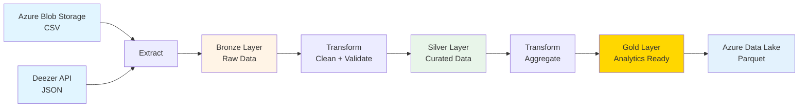
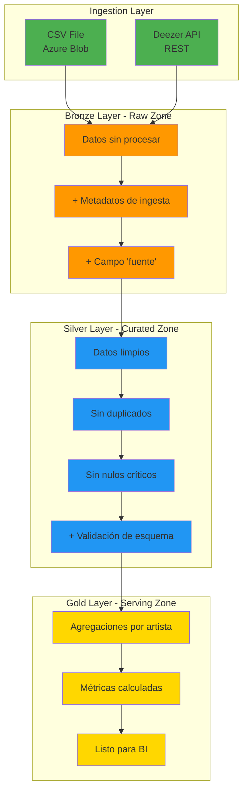
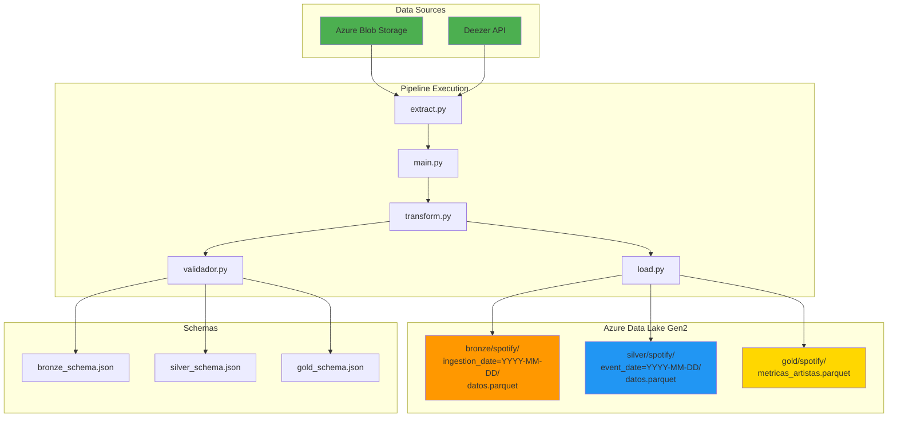

# Arquitectura del Pipeline

> Documentación técnica del pipeline Spotify Analytics. Creada para el proyecto final BSG.

## Cómo funciona el pipeline (overview)



## Arquitectura Medallion (Bronze/Silver/Gold)



La idea es simple: Bronze = datos crudos, Silver = limpio, Gold = listo para análisis.

---
## Servicios de Azure que uso

| Servicio | Para qué lo uso |
| Azure Blob Storage | Guardar el CSV de entrada |
| Deezer API | API pública de música (más simple que Spotify) |
| Azure Data Lake Gen2 | Almacenar Bronze/Silver/Gold en Parquet |
| (Futuro) Azure Data Factory | Automatizar ejecuciones |
| (Futuro) Synapse Analytics | Hacer queries SQL sobre los datos |

---

## Flujo del pipeline

### Paso 1: Extracción

```python
# 1. Bajar CSV de Azure Blob
df_csv = dwspotify()

# 2. Llamar a Deezer API para más datos
df_api = llamar_api()
```

**Nota:** Si la API falla, el pipeline sigue solo con CSV.

### Paso 2: Capa Bronze

# 2. Llamar a Deezer API
df_api = llamar_api()
# Retorna: DataFrame con top tracks de 10 artistas
```
**Características:**
- Timeout de 10 segundos por request
- Manejo de errores por artista (continúa si uno falla)
- Sin autenticación (API pública)

### 3.2 Fase de Transformación Bronze

```python
datos_bronze = crear_bronze(df_csv, df_api)
```

**Operaciones:**
1. Agregar columna `fuente` ('CSV' o 'API')
2. Combinar ambos DataFrames con `concat()`
3. Agregar timestamp de ingesta
4. Validar esquema contra `bronze_schema.json`

**Particionado:** `bronze/spotify/ingestion_date=YYYY-MM-DD/`

### 3.3 Fase de Transformación Silver

```python
datos_silver = limpiar_datos(datos_bronze)
```

**Operaciones:**
1. Eliminar filas con `nombre_artista` nulo
2. Eliminar duplicados por `(id_artista, cancion)`
3. Agregar `fecha_procesamiento`
4. Validar esquema contra `silver_schema.json`

**Particionado:** `silver/spotify/event_date=YYYY-MM-DD/`

### 3.4 Fase de Transformación Gold

```python
datos_gold = agregar_metricas(datos_silver)
```

Agrupa por artista y calcula:
- Total canciones
- Popularidad promedio
- Popularidad máxima

**Output:** `gold/spotify/metricas_artistas.parquet`

### Paso 5: Carga a Azure

```python
guardar_bronze(datos_bronze)
guardar_silver(datos_silver)
guardar_gold(datos_gold)
```

Sube todo a Azure Data Lake como Parquet (overwrite=True).

---

## Riesgos y cómo los manejo

| Qué puede fallar | Qué tan probable | Qué hago |
|------------------|------------------|----------|
| API Deezer caída | Medio | Pipeline sigue solo con CSV |
| Credenciales Azure malas | Bajo | Falla rápido con error claro |
| CSV cambió formato | Medio | Validación con JSON Schema |
| Duplicados en datos | Alto | Deduplicación en Silver |

---

## Logs y debugging

Uso logging de Python con 3 niveles: INFO/WARNING/ERROR

Ejemplo de logs:
```
INFO - Descargando spotify_wrapped_2025.csv
INFO - Archivo descargado: 1543 registros
INFO - Capa Bronze creada: 1593 registros
INFO - Capa Silver creada: 1589 registros
INFO - Capa Gold creada: 120 artistas
```

## Decisiones técnicas importantes

### 1. ¿Por qué Deezer y no Spotify API?

Spotify OAuth es complicado. Deezer es pública y gratis.

### 2. ¿Por qué Parquet?

Más eficiente que CSV:
- Compresión mejor (~10x)
- Lee más rápido
- Guarda tipos de datos

### 3. ¿Por qué Medallion (Bronze/Silver/Gold)?

Es el estándar en Data Lakes:
- Bronze = raw (puedo reprocesar si algo sale mal)
- Silver = limpio
- Gold = para dashboards

### 4. Validación con JSON Schema

Detecta cuando el CSV cambia de formato antes de romper todo.

**Consecuencias:**
-  Integración nativa con Synapse
-  Particionamiento Hive-style
-  Control de acceso granular (RBAC)
-  Vendor lock-in con Azure

---

## 7. Próximos Pasos (Backlog)

1. **Orquestación:** Migrar a Azure Data Factory con triggers diarios
2. **Serving:** Crear tablas externas en Synapse Analytics
3. **Monitoring:** Configurar Azure Monitor con alertas
4. **Calidad de Datos:** Agregar Great Expectations
5. **Reintentos:** Implementar exponential backoff para API
6. **Particionamiento Gold:** Particionar por fecha para datos históricos
7. **CI/CD:** Terraform para IaC de recursos Azure

---

## 8. Diagrama de Componentes


