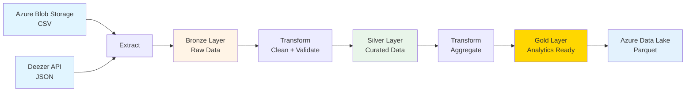
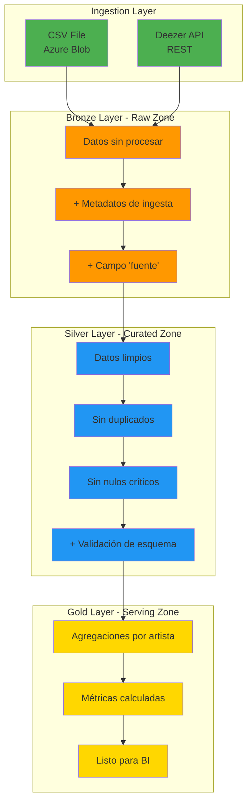
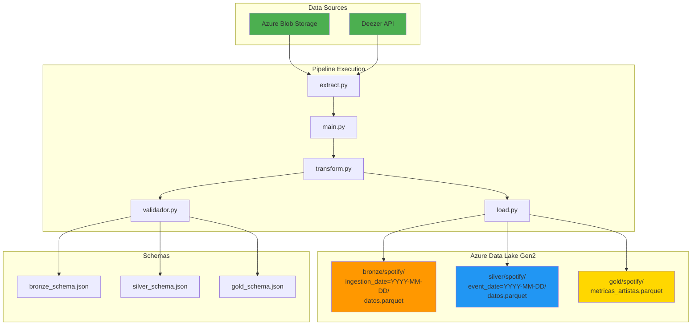

# Arquitectura del Pipeline Spotify Analytics

## 1. Diseño Lógico

### 1.1 Flujo de Datos



### 1.2 Arquitectura Medallion



---

## 2. Mapeo a Servicios Azure

| Componente | Servicio Azure | Propósito |
|------------|----------------|-----------|
| **Almacenamiento de entrada** | Azure Blob Storage | Almacenar CSV histórico de Spotify |
| **API externa** | Deezer Public API | Obtener datos de artistas en tiempo real |
| **Bronze Storage** | Azure Data Lake Gen2 | Datos raw en formato Parquet particionado |
| **Silver Storage** | Azure Data Lake Gen2 | Datos limpios y validados |
| **Gold Storage** | Azure Data Lake Gen2 | Datos agregados listos para análisis |
| **Orquestación (futuro)** | Azure Data Factory | Programar ejecuciones automáticas |
| **Analytics (futuro)** | Azure Synapse Analytics | Consultas SQL sobre Parquet |
| **Monitoring** | Azure Monitor + Logs | Observabilidad y alertas |

---

## 3. Flujo Detallado del Pipeline

### 3.1 Fase de Extracción

```python
# 1. Descargar CSV desde Azure Blob Storage
df_csv = dwspotify()
# Retorna: DataFrame con columnas de Spotify Wrapped

# 2. Llamar a Deezer API
df_api = llamar_api()
# Retorna: DataFrame con top tracks de 10 artistas
```

**Características:**
- Timeout de 10 segundos por request
- Manejo de errores por artista (continúa si uno falla)
- Sin autenticación (API pública)

### 3.2 Fase de Transformación Bronze

```python
datos_bronze = crear_bronze(df_csv, df_api)
```

**Operaciones:**
1. Agregar columna `fuente` ('CSV' o 'API')
2. Combinar ambos DataFrames con `concat()`
3. Agregar timestamp de ingesta
4. Validar esquema contra `bronze_schema.json`

**Particionado:** `bronze/spotify/ingestion_date=YYYY-MM-DD/`

### 3.3 Fase de Transformación Silver

```python
datos_silver = limpiar_datos(datos_bronze)
```

**Operaciones:**
1. Eliminar filas con `nombre_artista` nulo
2. Eliminar duplicados por `(id_artista, cancion)`
3. Agregar `fecha_procesamiento`
4. Validar esquema contra `silver_schema.json`

**Particionado:** `silver/spotify/event_date=YYYY-MM-DD/`

### 3.4 Fase de Transformación Gold

```python
datos_gold = agregar_metricas(datos_silver)
```

**Operaciones:**
1. Agrupar por `(nombre_artista, id_artista)`
2. Calcular:
   - Total de canciones
   - Popularidad promedio (redondeado a 2 decimales)
   - Popularidad máxima
3. Validar esquema contra `gold_schema.json`

**Particionado:** `gold/spotify/metricas_artistas.parquet` (sin partición)

### 3.5 Fase de Carga

```python
guardar_bronze(datos_bronze)
guardar_silver(datos_silver)
guardar_gold(datos_gold)
```

**Características:**
- Formato: Apache Parquet (compresión eficiente)
- Overwrite: `True` (reemplaza datos existentes)
- Cliente: Azure Data Lake Storage Gen2 SDK

---

## 4. Riesgos y Mitigaciones

| Riesgo | Probabilidad | Impacto | Mitigación |
|--------|--------------|---------|------------|
| **API Deezer no disponible** | Media | Bajo | Pipeline continúa solo con CSV (degradación graceful) |
| **Credenciales Azure inválidas** | Baja | Alto | Validar al inicio, retornar error claro |
| **Cambio en esquema CSV** | Media | Alto | Validación con JSON Schema en cada capa |
| **Duplicados en datos** | Alta | Medio | Deduplicación en capa Silver |
| **Archivos Parquet corruptos** | Baja | Alto | Validar escritura, mantener versión anterior |
| **Rate limiting de API** | Baja | Bajo | Timeout configurado (10s), reintentos (futuro) |

---

## 5. Observabilidad

### 5.1 Logs

**Niveles implementados:**
- `INFO`: Progreso normal del pipeline
- `WARNING`: API no disponible, datos faltantes
- `ERROR`: Fallos críticos que detienen el pipeline

**Ejemplo de logs:**
```
2026-04-19 10:30:15 - INFO - Iniciando APi Spotify
2026-04-19 10:30:16 - INFO - Descargando spotify_wrapped_2025.csv desde spotify-data
2026-04-19 10:30:17 - INFO - Archivo descargado: 1543 registros
2026-04-19 10:30:18 - INFO - Conectando a Deezer API
2026-04-19 10:30:22 - INFO - Datos de Deezer API obtenidos: 50 registros
2026-04-19 10:30:23 - INFO - Capa Bronze creada: 1593 registros
2026-04-19 10:30:24 - INFO - Capa Silver creada: 1589 registros
2026-04-19 10:30:25 - INFO - Capa Gold creada: 120 artistas únicos
```

### 5.2 Métricas Clave

| Métrica | Cómo obtenerla | Umbral de alerta |
|---------|----------------|------------------|
| Registros Bronze | `len(datos_bronze)` | < 100 registros |
| % de pérdida Silver/Bronze | `(1 - len(silver)/len(bronze)) * 100` | > 10% |
| Tiempo de ejecución | Logs de inicio/fin | > 5 minutos |
| Errores de API | Count de warnings | > 50% de requests |

### 5.3 Validaciones

**Por capa:**
- **Bronze:** Columnas requeridas (`nombre_artista`, `fuente`, `ingestion_timestamp`)
- **Silver:** + validación de tipos (int, float, datetime)
- **Gold:** + validación de rangos (popularidad 0-100)

**Implementación:**
```python
validar_datos(df, capa='bronze|silver|gold')
# Retorna: True/False + logging de errores
```

---

## 6. Decisiones de Diseño (ADRs)

### 6.1 ¿Por qué Deezer API en vez de Spotify API?

**Contexto:** Spotify API requiere autenticación OAuth compleja.

**Decisión:** Usar Deezer API pública (sin auth).

**Consecuencias:**
-  Más simple de implementar
-  Sin límites de rate estrictos
-  Menos datos disponibles (sin géneros detallados)
-  Menor precisión en popularidad

### 6.2 ¿Por qué Parquet en vez de CSV?

**Contexto:** Necesidad de almacenar datos eficientemente en la nube.

**Decisión:** Apache Parquet para todas las capas.

**Consecuencias:**
-  Compresión ~10x mejor que CSV
- Lectura columnar eficiente
- Compatible con Synapse/Databricks
-  No legible por humanos (requiere herramientas)

### 6.3 ¿Por qué Azure Data Lake Gen2?

**Contexto:** Compatibilidad con entorno laboral existente.

**Decisión:** ADLS Gen2 como storage principal.

**Consecuencias:**
-  Integración nativa con Synapse
-  Particionamiento Hive-style
-  Control de acceso granular (RBAC)
-  Vendor lock-in con Azure

---

## 7. Próximos Pasos (Backlog)

1. **Orquestación:** Migrar a Azure Data Factory con triggers diarios
2. **Serving:** Crear tablas externas en Synapse Analytics
3. **Monitoring:** Configurar Azure Monitor con alertas
4. **Calidad de Datos:** Agregar Great Expectations
5. **Reintentos:** Implementar exponential backoff para API
6. **Particionamiento Gold:** Particionar por fecha para datos históricos
7. **CI/CD:** Terraform para IaC de recursos Azure

---

## 8. Diagrama de Componentes


