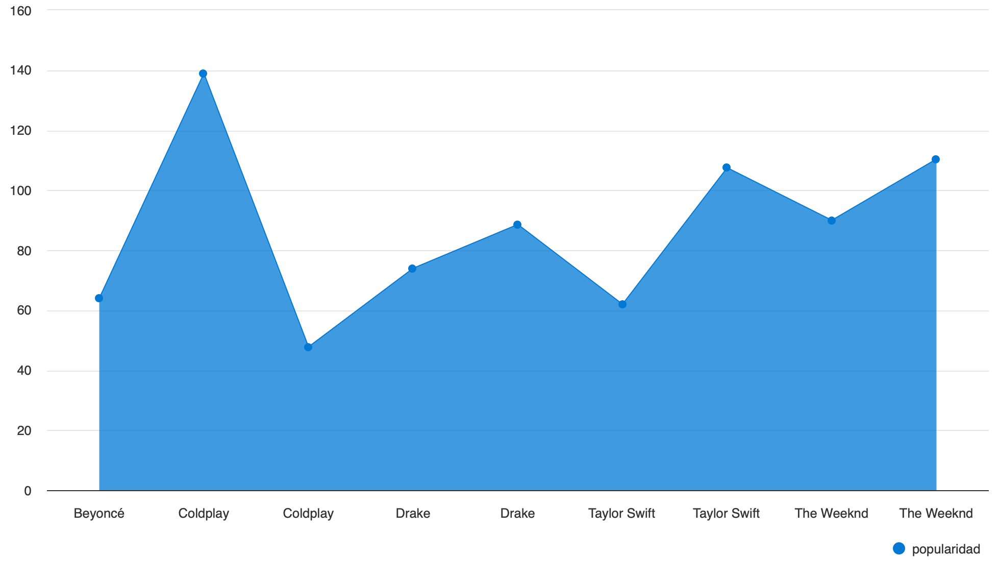
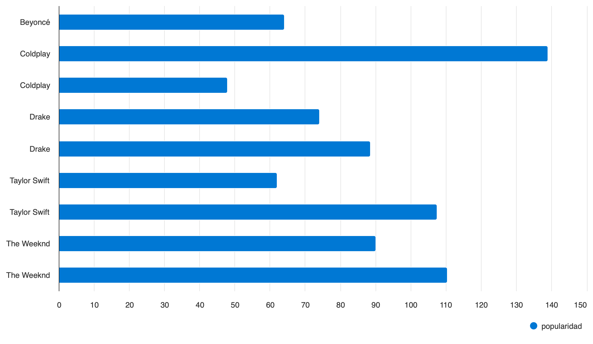
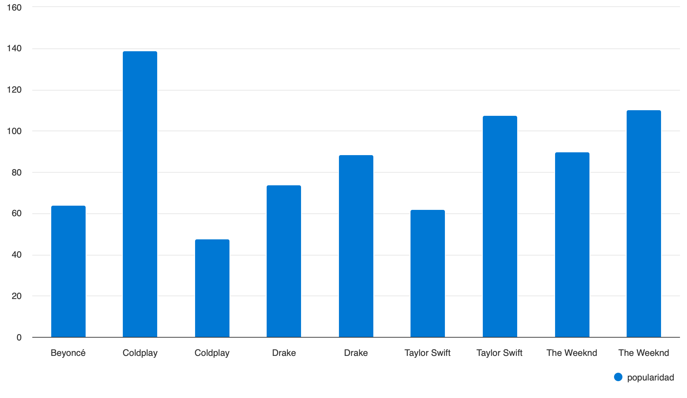
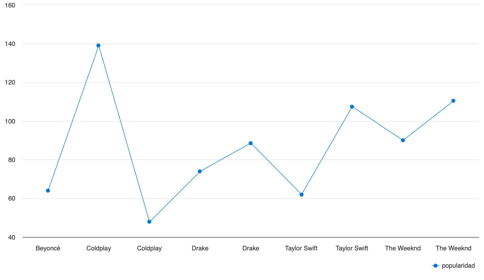
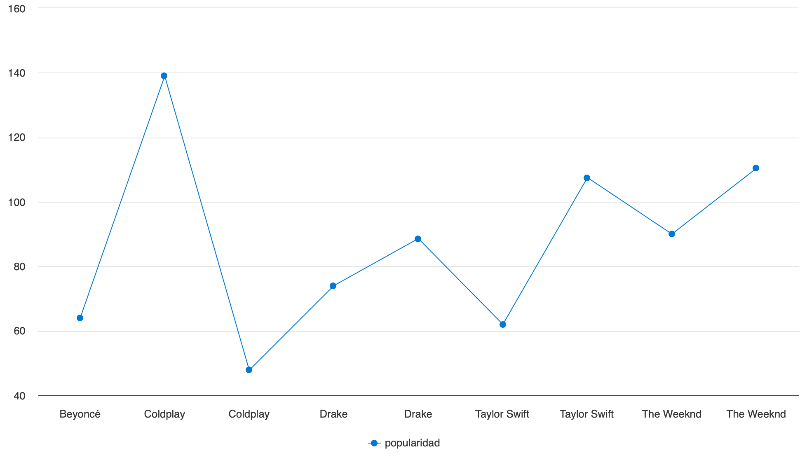
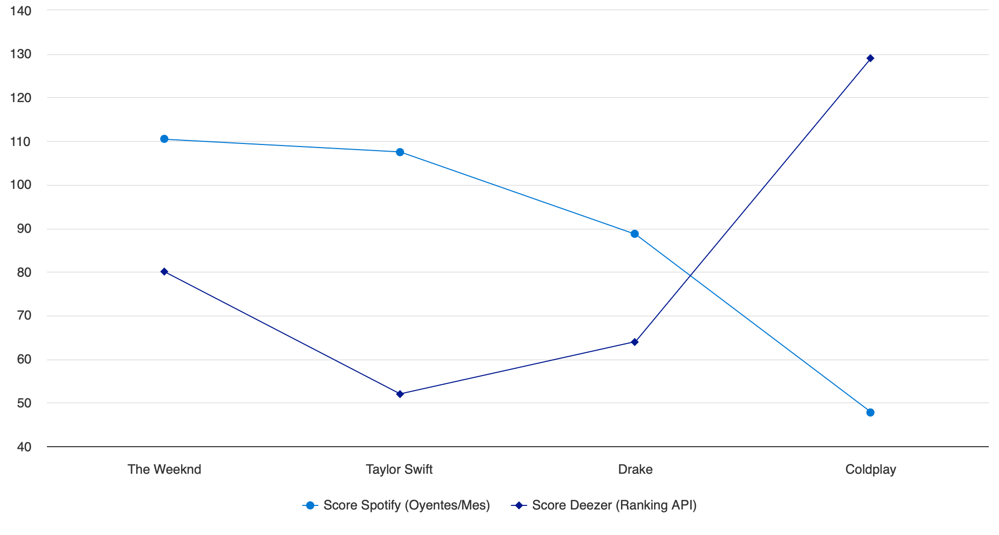
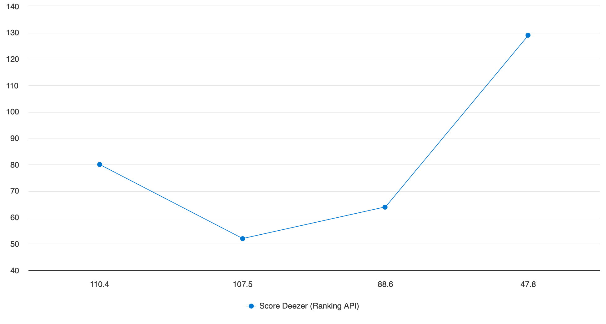
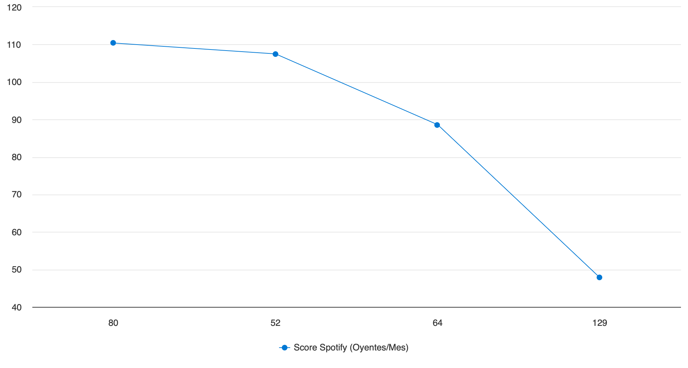
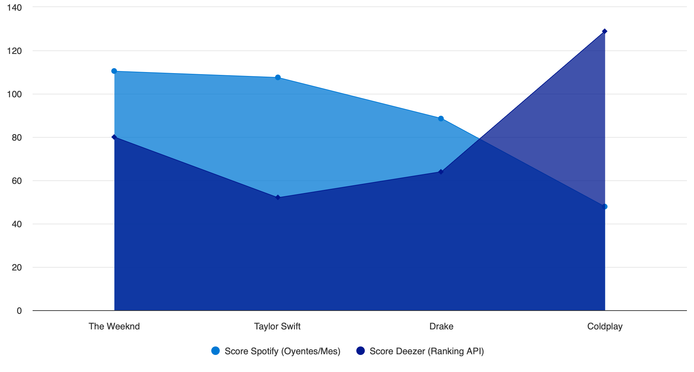
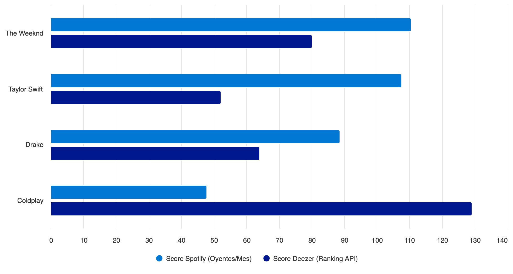

# Reporte Analítico: Gráficas Obtenidas con Azure Synapse

Este documento presenta los resultados visuales extraídos directamente desde nuestra capa **Gold** (almacenada en formato Parquet en Azure Data Lake Gen2). 

Para generar estos gráficos, utilizamos el motor **Serverless SQL Pool** de **Azure Synapse Analytics**, lo que nos permitió consultar los datos estructurados y cruzarlos (JOINs) mediante SQL estándar sin necesidad de provisionar infraestructura dedicada.

##  1. Comparativa de la data

En esta fase, construimos un query analítico para enfrentar las métricas de los artistas extraídos del Dataset crudo (CSV) contra las métricas frescas obtenidas consultando la API pública de Deezer.

```sql
WITH MetricasSpotify AS (
    SELECT 
        artist_name as Artista,
        CAST(monthly_listeners_millions_mar2026 AS FLOAT) as Popularidad_Spotify
    FROM 
        OPENROWSET(
            BULK 'https://<datalake>.dfs.core.windows.net/golddata/spotify_wrapped_2025_top50_artists.csv',
            FORMAT = 'CSV',
            PARSER_VERSION = '2.0',
            HEADER_ROW = TRUE
        ) AS s
),
MetricasDeezer AS (
    SELECT 
        nombre_artista as Artista,
        CAST(popularidad_promedio AS FLOAT) as Popularidad_Deezer
    FROM 
        OPENROWSET(
            BULK 'https://<datalake>.dfs.core.windows.net/golddata/metricas_artistas.parquet',
            FORMAT = 'PARQUET'
        ) AS d
)
SELECT TOP 15
    S.Artista,
    S.Popularidad_Spotify AS [Score Spotify (Oyentes/Mes)],
    D.Popularidad_Deezer AS [Score Deezer (Ranking API)]
FROM 
    MetricasSpotify S
INNER JOIN 
    MetricasDeezer D ON S.Artista = D.Artista
ORDER BY 
    S.Popularidad_Spotify DESC;
```

###  Resultados Visuales Generados

A continuación, se muestran las diferentes perspectivas de los datos consultados directamente en el Dashboard de exploración rápida de **Synapse Studio**:

*(Imágenes extraídas de la ejecución en Azure Synapse)*

<br>

<br>

<br>

<br>

<br>

<br>

<br>

<br>

# 2. Análisis del Top 50 y Tendencias

Adicional al cruce de plataformas, consultamos la capa general consolidada para visualizar relaciones como la popularidad versus la cantidad de canciones analizadas o el recuento general de géneros.

<br>

<br>

<br>

<br>

<br>

<br>

<br>

<br>

<br>

<br>

<br>

<br>

##  Conclusión
A través de **Azure Synapse**, confirmamos que la arquitectura Medallion diseñada cumple su propósito:
* Los datos en la **Capa Gold** están pre-calculados (agregaciones funcionales).
* El cruce entre el CSV histórico y la API dinámica enriquece el modelo.
* La tecnología Serverless SQL de Azure permite extraer valor de negocio de forma inmediata y bajo demanda pagando solo por procesamiento de queries.
